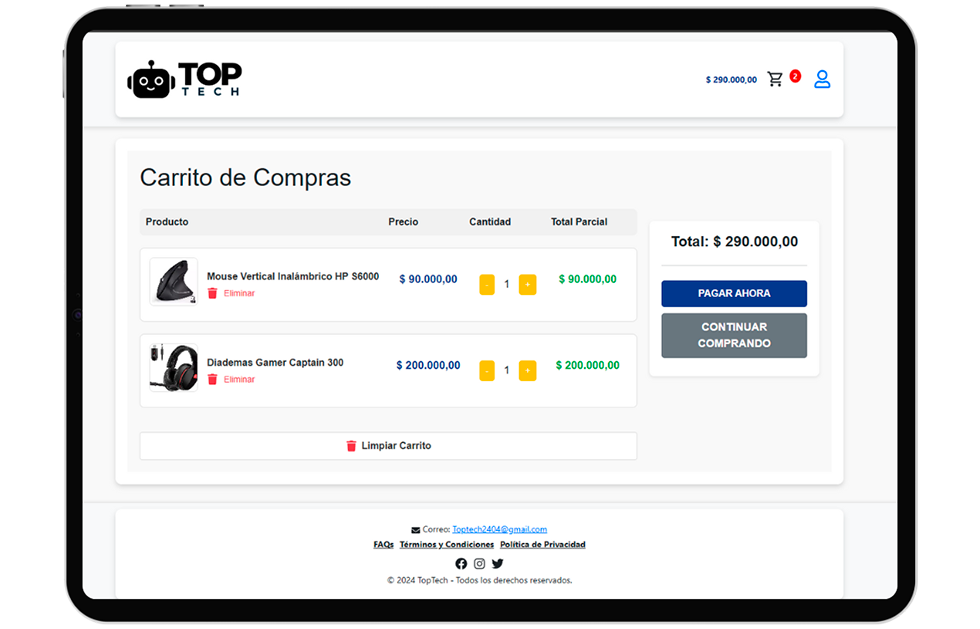

# TopTech - E-commerce de Productos Tecnológicos

## Descripción
**TopTech** es un e-commerce de productos tecnológicos desarrollado como proyecto académico para la clase de Administración de la Información. El sistema permite a los usuarios navegar, buscar y comprar productos tecnológicos, mientras que los administradores pueden gestionar el inventario y los pedidos.

## Tabla de Contenidos
- [Capturas de Pantalla](#capturas-de-pantalla)
- [Documentación](#documentación)
- [Características](#caracteristicas)
- [Arquitectura del Proyecto](#arquitectura-del-proyecto)
- [Requisitos](#requisitos)
- [Autores](#autores)

## **Capturas de Pantalla**

### Página Principal

### Carrito de Compras

### Panel de Administración

Estas imágenes muestran la funcionalidad y diseño de la aplicación **TopTech** en acción.

## Documentación

- [Manual de Usuario](docs/Manual_de_Usuario_TOPTECH.pdf)  

## Características
- **Catálogo de Productos**: Visualización, búsqueda y filtrado de productos.
- **Gestión de Carrito de Compras**: Añadir y eliminar productos, cálculo de totales.
- **Gestión de Usuario**: Asignar roles, editar y eliminar usuarios.
- **Procesamiento de Pagos**: *Pendiente*
- **Autenticación de Usuarios**: Registro e inicio de sesión.

## Arquitectura del Proyecto
**TopTech** sigue una arquitectura de tres capas:

- **Frontend (Presentación)**: Construido con **React.js** y **Bootstrap** para garantizar una interfaz amigable y responsiva.
- **Backend (Lógica de Negocio)**: Implementado con **Node.js** y **Express.js**, manejando autenticación y la lógica principal de la aplicación.
- **Base de Datos (Datos)**: Utiliza **MongoDB** para almacenar los datos de usuarios, productos y pedidos.

Cada capa cumple una función específica y colabora para crear un sistema eficiente y escalable.

## Requisitos

- **Frontend**:
  - [React.js](https://reactjs.org/)
  - [Bootstrap](https://getbootstrap.com/)
- **Backend**:
  - [Node.js](https://nodejs.org/)
  - [Express.js](https://expressjs.com/)
  - [MongoDB](https://www.mongodb.com/) como base de datos
- **Herramientas**:
  - [Visual Studio Code](https://code.visualstudio.com/)
  - [Git](https://git-scm.com/) y [GitHub](https://github.com/) para control de versiones
  - [Postman](https://www.postman.com/) para pruebas de API

## Autores

- **Sebastian Andres Gaviria Ramos** - Líder del Proyecto
- **Johan Steven Hincapie Ceron**
- **Juan Manuel Hernandez Gomez**
- **Sergio Rafael López Gutiérrez**
- **Oscar Danilo Plaza Ocampo**

- **Jair Enrique Sanclemente Castro** - Product Owner